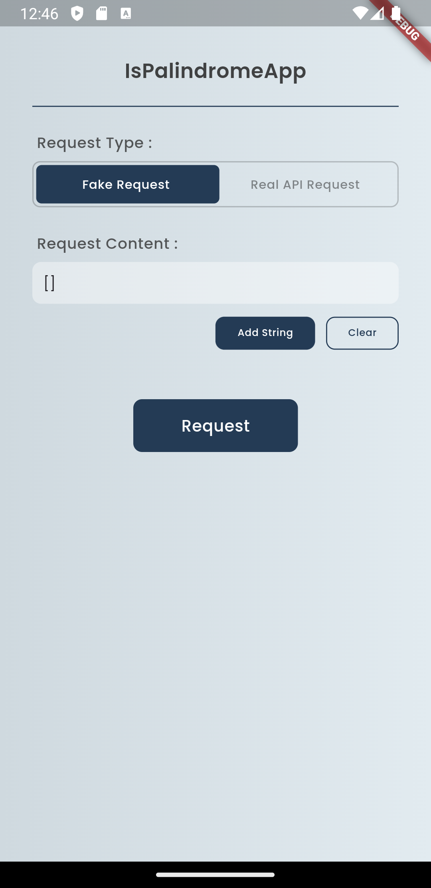
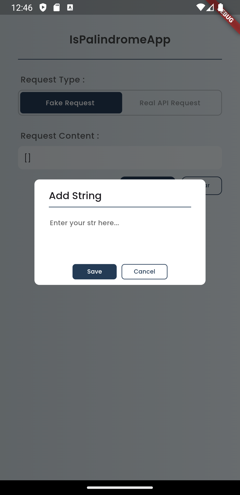
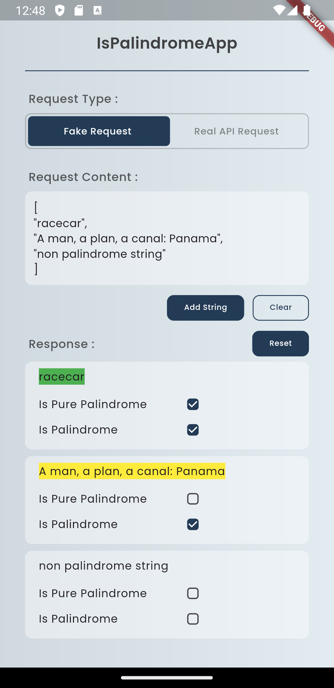

# Simple Pancake Two

This project is created for the challenge mentioned in the [GitHub repository](https://github.com/tanselOzkusaksiz/simple-pancake-two?tab=readme-ov-file#the-challenge).

## Screenshots

### ScreenShot 1

###  ScreenShot 2

###  ScreenShot 3

